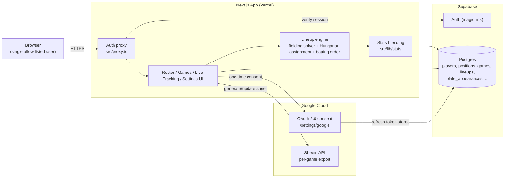

# Kickball Manager

A web app for managing a coed rec kickball team: generating batting orders and
fielding lineups that respect fairness and gender-position rules, tracking
in-game stats, and exporting each game to a live Google Sheet.

## Why this exists

Recreational coed kickball leagues have a few recurring headaches on game day:
everyone needs to bat every inning, everyone should get equal time in the
field, fielding has to respect gender-position limits, and someone has to
build all of that into a lineup by hand — then track outs and scoring on a
spreadsheet during the game. This app automates the lineup construction and
gives that spreadsheet a real data model behind it.

## Features

- [x] Roster management with per-player baseline scouting ratings for
      batting (power / placement / bunting / baserunning, 1-10, average 5).
      Fielding fit isn't derived from skill axes — it's rated directly per
      player per position (1-10, default 5) on the player's edit page
- [x] Fielding rotation generator — equal field-innings per player (a
      greedy least-fielded-so-far rule, applied within each gender first
      to satisfy the league's per-inning gender minimums, then across
      whoever's left), and best-fit position assignment via a from-scratch
      Hungarian algorithm over each player's direct rating at each position
- [x] Configurable position model — per-position importance, weighted into
      the assignment optimization alongside each player's rating there
- [x] Batting order generator — configurable slot archetypes (Leadoff,
      Connector, Cleanup, Balanced) each with their own skill-axis weights,
      seeded from scouting ratings until real stats accumulate
- [x] Manual overrides — reorder the batting order, swap fielding assignments
      per inning, after generating
- [x] Live game-day tracking — one-tap plate-appearance entry that auto-advances
      through the batting order, a derived (not stored) inning/outs/score state,
      per-inning scoreboard. Baserunning-event and defensive-note logging are
      built but not working in practice yet; a redesign is tracked in
      [#5](https://github.com/ConnorStutsrim/kickball-manager/issues/5)
- [x] Google Sheets export — one-click per-game spreadsheet (fielding grid,
      batting order, blank scoring section for live use), shaped after the
      team's own existing spreadsheet; regenerating updates the same sheet
      rather than creating a new one
- [x] Season stat history feeding back into lineup suggestions — batting
      profiles blend manual scouting ratings with real stats derived from
      plate appearances (power, placement, baserunning, bunting), weighted
      by how much evidence exists for each specific stat, converted onto the
      1-10 scale by percentile rank within the active roster

## Tech stack

- **Framework:** Next.js (App Router) + TypeScript + Tailwind CSS + shadcn/ui
- **Database:** Postgres via [Supabase](https://supabase.com)
- **ORM:** [Drizzle](https://orm.drizzle.team)
- **Auth:** Supabase Auth (single allow-listed user)
- **Sheets export:** Google Sheets API (`googleapis`, OAuth2)
- **Hosting:** Vercel (app) + Supabase (DB/auth)
- **Testing:** Vitest (unit) + Playwright (e2e)
- **CI:** GitHub Actions

## Architecture



The lineup engine is a set of pure, unit-tested functions (`src/lib/lineup/`):

- **Fielding rotation solver** — who fields each inning is decided fresh
  every inning by a greedy least-fielded-so-far rule: filled within each
  gender first (to satisfy the league's per-inning gender minimums), then
  across whoever's left, keeping field-innings as equal as possible both
  within each gender and across the whole roster. Position assignment is a
  pure best-fit optimization: an importance-weighted optimal assignment
  (Hungarian algorithm) over each player's direct 1-10 rating at every
  position (default 5 when unrated) — no derived skill-axis formula.
- **Batting order strategy** — the same aptitude-weighting idea applied to
  batting: slot 1 is Leadoff, 2 is Connector, 3 and 4 are Cleanup, every slot
  in between reuses Balanced, and the very last batter is Leadoff again (a
  "second leadoff" right before the order turns back over). Each archetype's
  skill-axis weights (power / placement / bunting / baserunning) are
  configurable, not hardcoded. Early in a season the per-player profile comes
  from manually-entered scouting ratings; as real plate appearances
  accumulate (`src/lib/stats/`), each axis blends toward stat-derived values
  — weighted per-axis by its own relevant sample size (total plate
  appearances, times reached base, or bunt attempts, whichever applies),
  not one global count.

Game state during live tracking (`src/lib/game/game-state.ts`) is computed,
not stored: whose turn it is, the inning/half/outs, and the running score are
all derived from the recorded plate appearances, baserunning events, and
opponent per-inning runs on every read — there's no separate "current state"
row that could drift out of sync with the play-by-play data.

## Roadmap

1. ✅ Repo scaffold
2. ✅ Core schema + CRUD (players, league rules, positions, seasons, games)
3. ✅ Lineup generation engine (fielding solver + best-fit position assignment
   + rating-based batting order)
4. ✅ Live game-day stat tracking (derived game state, plate appearances,
   opponent scoring) — baserunning/defensive-note logging shipped but isn't
   working in practice; redesign tracked in
   [#5](https://github.com/ConnorStutsrim/kickball-manager/issues/5)
5. ✅ Google Sheets export (per-game spreadsheet matching the team's real
   sheet, OAuth-connected, regenerate-in-place)
6. ✅ Stats-driven lineup suggestions — batting profiles blend season stats
   into the qualitative ratings, weighted by per-axis sample size
7. ⬜ Polish: season stats dashboard, demo/seed data, deploy *(next)*

Smaller tracked work: see [open issues](https://github.com/ConnorStutsrim/kickball-manager/issues).

## Local development

```bash
npm install
cp .env.example .env.local  # fill in Supabase + Google credentials
npm run dev
```

Other scripts:

```bash
npm run lint        # eslint
npm run typecheck    # tsc --noEmit
npm run test         # vitest
npm run db:generate  # generate a Drizzle migration from src/db/schema.ts
npm run db:migrate   # apply migrations
npm run db:studio    # browse the DB with Drizzle Studio
```
